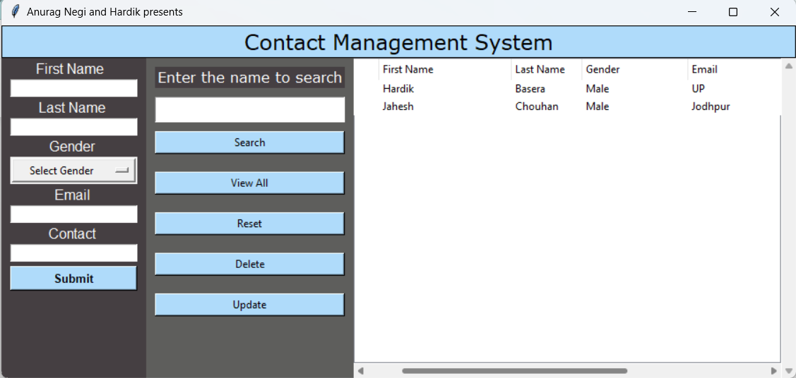

# Contact List
Taking name and number as input from the user and listing the contacts 
This is a part of our DevSecOps project in pair programming. 
Version 1 of the project has been uploaded. You can setup the project in your system -reference(contribute.md) and provide the feedback in the github discussions 
<h1>Version 1</h1>

