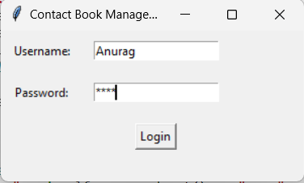

# Contact List

Taking name and number as input from the user and listing the contacts

This is a part of our DevSecOps project in pair programming.

Version 1 of the project has been uploaded. You can set up the project in your system - [reference contribute.md](contribute.md) and provide the feedback in the [GitHub discussions](https://github.com/Anurag-Negi28/contact_list/discussions).

## Version 1

## Issues

<li>Login page issue has been addressed in the Version2 of the project</li>
<li>Display error in the GUI of Version1 has also been addressed in the Version2 of the project</li>

## Version 2

Login page

Version 2 GUI after login

